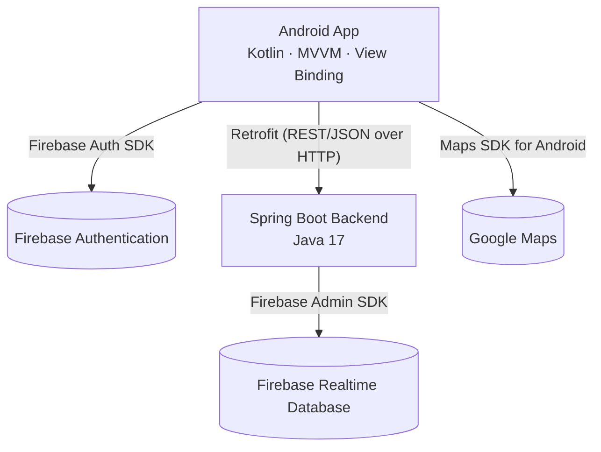

# Travelo

Travelo is a trip-planning marketplace that connects three kinds of users — **Guides**, who assemble multi-stop group trips; **Businesses**, who publish bookable offers (tours, meals, tickets, activities); and **Travelers**, who follow the finished itinerary. A Guide picks a set of marketplace offers for a trip, and a custom optimization algorithm on the backend sequences them into a route that respects each offer's opening hours, the trip's budget, and a total time cap — while maximizing profit and minimizing distance, time, and cost according to the Guide's own preference weights.

This repository contains **two independent projects**:

```
Travelo---Final-Project/
├── android-app/   Kotlin Android client (Guide / Business / Traveler)
└── backend/       Spring Boot REST API + route optimization engine
```

They are documented separately below, since they're built, run, and reviewed independently.

## Table of Contents

- [System Architecture](#system-architecture)
- [Android App (`android-app/`)](#android-app-android-app)
  - [Tech Stack](#android-tech-stack)
  - [User Roles & Flows](#user-roles--flows)
  - [Running Locally](#running-the-android-app-locally)
  - [Key Code — Algorithm Weight Controls](#key-code--algorithm-weight-controls)
- [Backend API (`backend/`)](#backend-api-backend)
  - [Tech Stack](#backend-tech-stack)
  - [Running Locally](#running-the-backend-locally)
  - [REST API Reference](#rest-api-reference)
  - [Key Algorithms & Formulas](#key-algorithms--formulas)
- [Known Limitations](#known-limitations)

---

## System Architecture



The Android app talks to Firebase Authentication directly for login/signup, and to the Spring Boot backend (over plain REST) for everything else — trips, marketplace offers, users, and route optimization. The backend is the only thing that talks to Firebase Realtime Database; it acts as the single source of truth and the only place business logic runs.

---

## Android App (`android-app/`)

### Android Tech Stack

- **Kotlin**, MVVM, **View Binding** (no Compose — the UI was fully migrated to XML Views + Fragments)
- **Jetpack Navigation Component** for screen-to-screen flow, backed by a single `nav_graph.xml`
- **Material 3** components (`MaterialCardView`, `Slider`, `MaterialAlertDialogBuilder`, etc.)
- **Retrofit2** (+ Gson and Scalars converters) for the REST client
- **Kotlin Coroutines** (`Dispatchers.IO` / `Dispatchers.Main`) for all network calls
- **Firebase Authentication** for email/password login and signup
- **Google Maps SDK for Android** for offer/route visualization
- **Lottie** for the login screen animation

### User Roles & Flows

| Role | What they do |
|---|---|
| **Guide** | Registers/logs in → creates a trip (destination, budget, time cap, start/end coordinates, and their own algorithm weight preferences) → gets a shareable trip code → browses marketplace offers on a map in **Route Selection**, checks which ones to consider → generates an optimized route → reviews the finished itinerary. |
| **Business** | Registers/logs in → publishes marketplace offers (price, location, opening hours, duration, expected profit) that Guides can discover and select. |
| **Traveler** | Enters a trip code shared by their Guide → views the finished itinerary (map + ordered stop list) → taps **Confirm Trip** to record their attendance. |

### Running the Android App Locally

1. Open the **`android-app/`** folder in Android Studio — not the repo root.
2. Create `android-app/local.properties` (gitignored, not committed — you need your own) with your Google Maps API key:
   ```properties
   MAPS_API_KEY=your_key_here
   ```
3. `android-app/app/google-services.json` is already committed (it contains only public Firebase project identifiers, not secrets), so Firebase Auth will work out of the box against the project it points to.
4. `RetrofitInstance.BASE_URL` is currently hardcoded to `http://10.0.2.2:8080/api/` — the special loopback alias Android emulators use to reach the host machine. Run the backend locally first (see below), then run the app on an emulator and it will just work. On a physical device, or against a deployed backend, change this constant to your machine's LAN IP or the deployed base URL.
5. Run the app from Android Studio (▶ Run, not "Apply Changes" — layout/nav changes don't always survive a hot-swap cleanly).

### Key Code — Algorithm Weight Controls

The four sliders in `CreateTripFragment` (Distance / Time / Cost / Profit sensitivity) are the app's control surface for the backend's route-scoring formula (see [Key Algorithms & Formulas](#key-algorithms--formulas) below). They're saved onto the Guide's `User` record so their preferences persist between trips:

```kotlin
// android-app/app/src/main/java/com/example/travelo/ui/trip/CreateTripFragment.kt
private suspend fun saveWeightPreferences(
    weightDistance: Double,
    weightTime: Double,
    weightCost: Double,
    weightProfit: Double
) {
    val uid = FirebaseAuth.getInstance().currentUser?.uid ?: return
    val existing = RetrofitInstance.api.getUser(uid)
    val currentUser = existing.body()
    if (existing.isSuccessful && currentUser != null) {
        val updatedUser = currentUser.copy(
            weightDistance = weightDistance,
            weightTime = weightTime,
            weightCost = weightCost,
            weightProfit = weightProfit
        )
        RetrofitInstance.api.registerUser(updatedUser)
    }
}
```

There is no dedicated "update preferences" endpoint on the backend, so this reuses `POST /api/users/register`, whose service implementation is an upsert (`setValueAsync` keyed by `userId`) rather than a strict create — see [REST API Reference](#rest-api-reference).

---

## Backend API (`backend/`)

### Backend Tech Stack

- **Java 17**, **Spring Boot**, built with **Maven**
- **Firebase Admin SDK**, talking to **Firebase Realtime Database** (not Firestore)
- **Lombok** (`@Data`, `@NoArgsConstructor`, `@AllArgsConstructor`) on all model classes
- [`ch.hsr.geohash`](https://github.com/kungfoo/geohash-java) for geospatial indexing

### Running the Backend Locally

1. Requires **Java 17+** and **Maven** (or use the bundled `./mvnw` / `mvnw.cmd` wrapper).
2. You need a Firebase project with **Realtime Database** enabled. In the Firebase Console, go to *Project Settings → Service Accounts → Generate new private key*, and save the downloaded file as:
   ```
   backend/src/main/resources/serviceAccountKey.json
   ```
   This file is **intentionally excluded from the repo** (`.gitignore`) since it's an admin credential — you must supply your own.
3. Update the database URL in `FirebaseConfig.java` to match your Firebase project:
   ```java
   .setDatabaseUrl("https://<your-project>-default-rtdb.<region>.firebasedatabase.app/")
   ```
4. Run it:
   ```bash
   ./mvnw spring-boot:run
   ```
   The server starts on port `8080` by default; every endpoint below is prefixed with `/api`.

### REST API Reference

| Method | Endpoint | Description |
|---|---|---|
| `POST` | `/api/users/register` | Create a user, **or** upsert one if the `userId` already exists (also used to persist algorithm weight preferences — see above) |
| `GET` | `/api/users/{id}` | Fetch a user by ID |
| `POST` | `/api/trips` | Create a trip |
| `GET` | `/api/trips/{id}` | Fetch a trip by its `tripId` |
| `GET` | `/api/trips` | Fetch every trip |
| `POST` | `/api/proposals` | Publish a marketplace offer (a Business's proposal) |
| `GET` | `/api/proposals/trip/{tripId}` | Fetch all offers for a trip (or the shared `GLOBAL_MARKETPLACE`) |
| `POST` | `/api/routes/generate/{tripId}` | Run the optimization algorithm over a set of selected offer IDs and persist the resulting route |
| `GET` | `/api/routes/trip/{tripId}` | Fetch the generated route for a trip |

### Key Algorithms & Formulas

This is the technical core of the project — everything else is CRUD around it.

#### 1. Route Scoring Formula

Every candidate stop is scored with a simple weighted linear utility function. The four weights are exactly the four sliders exposed to the Guide in the Android app (see above):

```java
// backend/src/main/java/com/example/demo/service/RouteOptimizer.java
private double score(double dist, double time, double cost, double profit,
                    double wDist, double wTime, double wCost, double wProfit) {
    return (profit * wProfit) - (dist * wDist) - (time * wTime) - (cost * wCost);
}
```

Higher profit is rewarded; distance, time, and cost are each independently penalized, scaled by how much the Guide says they care about each factor.

#### 2. Search Heuristic

The optimizer is a best-first search over a priority queue (an A*-style search, not brute-force permutation). Each state's priority (`fScore`) combines its actual score so far (`gScore`) with this optimistic heuristic estimate of the best score still reachable:

```java
// backend/src/main/java/com/example/demo/service/RouteOptimizer.java
private double heuristic(Set<Place> unvisited, double remainingTime, double remainingCost, double wProfit) {
    double estimate = 0;
    for (Place p : unvisited) {
        if (p.activityTime <= remainingTime && p.cost <= remainingCost) {
            estimate += p.profit * wProfit;
        }
    }
    return estimate;
}
```

It sums the profit of every still-affordable, still-time-feasible unvisited place, ignoring the travel cost of actually reaching them — an optimistic upper bound that lets the search prioritize promising branches without exhaustively exploring every permutation.

#### 3. Time-Window Feasibility Check

Every candidate next stop is checked against its own declared opening/closing hours before it's allowed into a route, using a flat travel-speed assumption (15 minutes per kilometer, i.e. roughly walking pace):

```java
// backend/src/main/java/com/example/demo/service/RouteOptimizer.java — inside optimizeRoute()
double legDist = distance(current.current, nextPlace);
double travelMinutes = legDist / 1000.0 * 15;
int arrival = current.currentClockMinutes + (int) travelMinutes;
int open = toMinutes(nextPlace.openTime);
int close = toMinutes(nextPlace.closeTime);
int visitStart = Math.max(arrival, open);
int visitEnd = visitStart + (int) nextPlace.activityTime;
if (visitEnd > close) {
    continue; // would still be there after closing time — this branch is invalid
}
```

This is what makes the search time-window-aware rather than purely distance/cost-aware — a stop that's cheap and profitable but would be visited after closing time is simply never added to the path.

#### 4. Geospatial Pre-filtering

Before the optimizer ever runs, `RouteService` narrows the full marketplace down to offers near the trip's start and end points, using 6-character geohashes (~1.2 km × 0.6 km cells):

```java
// backend/src/main/java/com/example/demo/model/GeoHashUtil.java
public static String encode(double lat, double lng) {
    return GeoHash.geoHashStringWithCharacterPrecision(lat, lng, 6);
}

public static Set<String> getGeoHashGrid(double lat, double lon) {
    GeoHash center = GeoHash.withCharacterPrecision(lat, lon, 6);
    Set<String> grid = new HashSet<>();
    grid.add(center.toBase32());
    for (GeoHash neighbor : center.getAdjacent()) {
        grid.add(neighbor.toBase32());
    }
    return grid;
}
```

Every proposal is geohashed once, when it's published. `RouteService` computes the 3×3 grid of cells around both the trip's start coordinates *and* its end coordinates, unions them, and only keeps proposals whose geohash falls in that combined grid — a cheap way to avoid asking the optimizer to consider offers from the other side of the map. See [Known Limitations](#known-limitations) for a side effect of this.

---

## Known Limitations

1. **The geohash pre-filter can silently exclude selected offers.** If a trip's start/end coordinates don't comfortably cover an offer a Guide explicitly checked in Route Selection, that offer gets dropped before the optimizer even sees it. If every selected offer gets filtered out this way, the app surfaces `"Optimization failed. Check constraints."`
2. **Trip confirmation is local-only.** The Traveler's "Confirm Trip" button persists on-device via `SharedPreferences`, scoped per Firebase user — there's no `travelerIds`-type field on `Trip`/`User` yet, so confirmation doesn't sync across a Traveler's devices.
